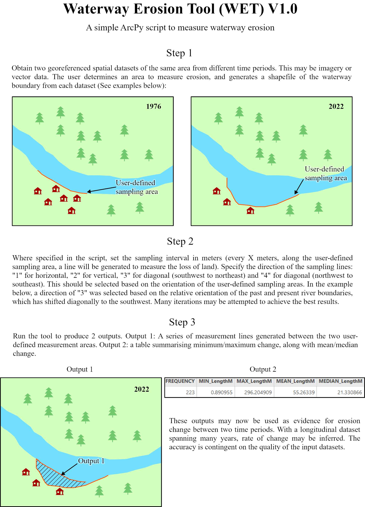

# Waterway Erosion Tool (WET) V1.0
A simple open source ArcPy script for measuring coastal and riverine erosion in the Yukon-Kuskokwim Delta.

  

# How it works

# Directory structure

	.
	├── init.sh
	├── main.py
	├── readme.md
	├── requirements.txt
	├── static
	│   └── css
	│      └── universal.css
	├── templates
	│   	└── index.html
	├── venv.sh
	└── wet.py

# Languages & Dependencies 
   

  

 

# Usage
## init.sh

## venv.sh 
Use the venv.sh bash script to activate your virtual enviroment: 
ii
~~~
source venv.sh 
~~~

To deactivate the virtual enviroment simply execute the deactivate command: 

~~~
deactivate
~~~ 

#Using the tool in ArcGIS Pro

To use this script in ArcGIS Pro, a copy of ArcGIS Pro 3.0 is required, along withtwo pre-georeferenced images of the region of interest. A seperate readme.html file and juptyer notebook file is located in the arcgis_pro directory. 

